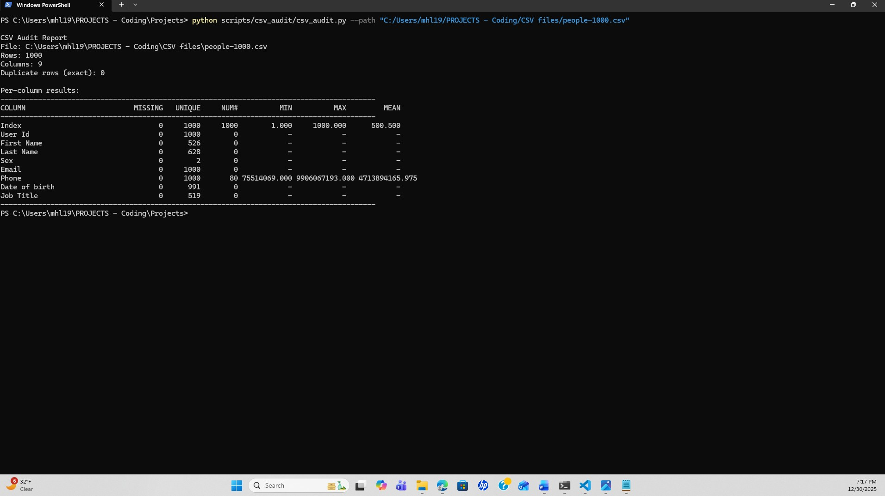

# CSV Audit Tool — csv_audit.py

A command-line utility for validating CSV files used in reporting, audits, and IT operations workflows.

## What It Does

- Reads any well-formed CSV with a header row
- Reports:
  - total rows and columns
  - missing values per column
  - exact duplicate rows
  - basic numeric statistics (min / max / mean)
- Optional outputs:
  - summary audit report CSV
  - duplicate rows CSV for remediation

Designed for safe, read-only inspection of data files.

---

## Usage

### Help

python csv_audit.py --help

## Execution Screenshots

### 1. Help Output
Displays available command-line options and usage.

### 2. Standard Run Mode
Executes a non-recursive disk usage report for a target path.

### 3. CSV Export
Exports disk usage metrics to a CSV file for reporting or auditing.

### 4. Recursive Scan — Permission Handling (Expected Behavior)
Demonstrates behavior when encountering protected system directories during
recursive scans on Windows.

