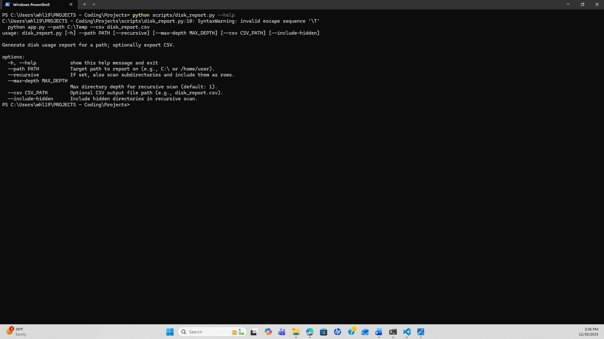
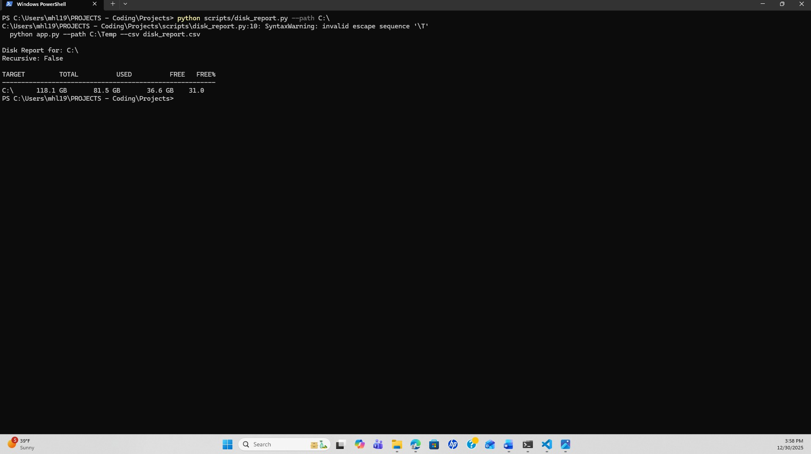
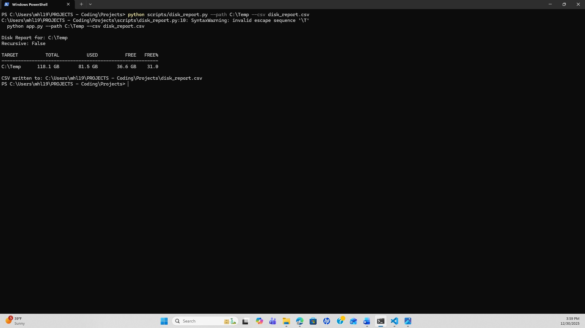
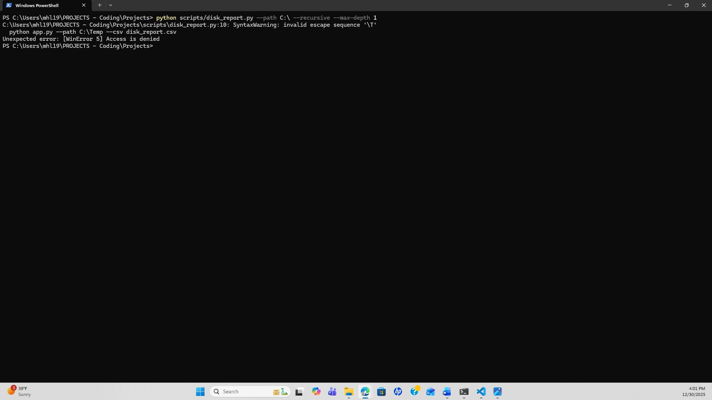

# Execution Proof — disk_report.py

This directory contains screenshots demonstrating execution of the
`disk_report.py` script in a Windows PowerShell environment.

Included evidence:

1. Help output (`--help`)
2. Standard run mode (safe default)
3. CSV export (`--csv`)
4. Recursive scan — permission handling (expected behavior)

These screenshots demonstrate safe defaults, clear CLI output, optional CSV
export, and real-world filesystem permission handling suitable for IT operations
and automation workflows.

## Execution Screenshots

### 1. Help Output
Displays available command-line options and usage.

### 2. Standard Run Mode
Executes a non-recursive disk usage report for a target path.

### 3. CSV Export
Exports disk usage metrics to a CSV file for reporting or auditing.

### 4. Recursive Scan — Permission Handling (Expected Behavior)
Demonstrates behavior when encountering protected system directories during
recursive scans on Windows.

